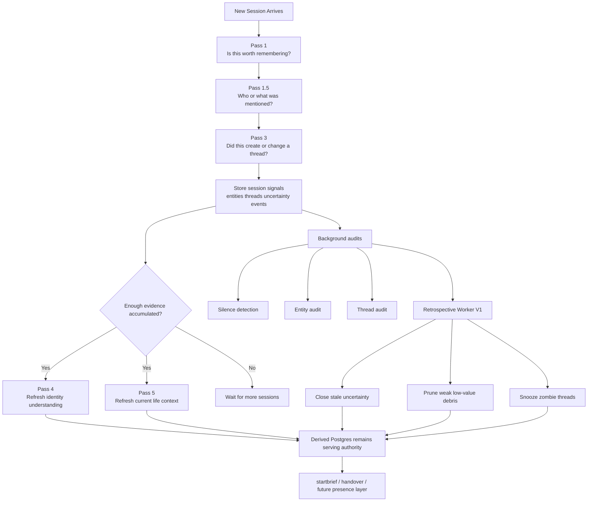

# Sophie Memory System: Simple Human Overview

Version: 2026-04-23  
Status: Current baseline overview

This is the simple version of how Sophie memory works today.

It is written for human understanding, not implementation detail.

If the detailed docs explain the ambition, this document explains the actual flow.

Related next-step design:
- `docs/SOPHIE_ALWAYS_ON_MEMORY_PACKET_SPEC.md`
- the always-on packet should orient runtime by enduring identity, important people, work/building, then the current chapter

## 1. The Big Picture

Sophie memory now has two layers:

1. Session-time memory work
- what do we learn from this one conversation?
- what should be remembered now?
- what changed right now?

2. Cross-time cleanup work
- after several sessions, what weak memory should be cleaned up?
- what stale uncertainty should be closed or pruned?
- what old threads should be snoozed or merged?

The first layer is fast and local.
The second layer is slower and more conservative.

That split matters.

Without it, every small session has to do too much.
With it, the system can stay careful during ingest and become cleaner over time.

## 2. What Happens When A Session Comes In

When a new session arrives, Sophie does not immediately rewrite her whole understanding of the person.

She first processes that session in smaller steps.

### Pass 1: Is this worth remembering?

The system looks at the session and asks:
- was anything memory-worthy said?
- were there meaningful updates?
- were there identity signals?
- were there thread signals?

This creates the basic structured record of the session.

### Pass 1.5: Who or what was mentioned?

The system then asks:
- is this a person?
- a project?
- the assistant?
- something too weak to trust yet?

This is where entity hygiene happens.

The goal is to stop bad identity state early:
- projects should not become people
- assistants should not become relationships
- empty entities should not surface
- durable roles should not be overwritten by weak noise

### Pass 3: Did this create or change an ongoing thread?

The system then asks:
- is there an open issue here?
- is this something ongoing?
- is this now resolved?
- should this update an existing thread instead of creating a new one?

This is the thread layer.

The goal is not to create as many threads as possible.
The goal is to keep a small number of real, useful, future-relevant threads.

## 3. What Does Not Run On Every Session

The deeper synthesis does not run in full every time a session comes in.

That is important.

### Pass 4: Identity refresh

This is the slower “who is this person?” refresh.

It runs only when enough identity-relevant material has built up.

In plain language:
- not every session changes identity understanding
- only enough meaningful accumulated evidence should do that

### Pass 5: Living-context refresh

This is the slower “what is going on in their life right now?” refresh.

It also runs only when enough meaningful context has built up.

In plain language:
- the system does not rewrite current context every time the user says something small
- it waits until there is enough evidence to justify a refresh

## 4. The Current Rhythm

Today the system has this rough rhythm:

- session arrives
- Pass 1 runs
- Pass 1.5 runs
- Pass 3 runs
- signals accumulate over sessions
- Pass 4 and Pass 5 run when thresholds are met
- background audits clean stale or risky state

So the system is not “daily full synthesis.”

It is:
- immediate session processing
- threshold-based deeper synthesis
- background cleanup

## 5. What The Retrospective Worker Adds

The retrospective worker exists because some memory judgments are only safe after time has passed.

Example:
- one session may mention something weakly
- three later sessions may make it clear what that weak thing actually was

That kind of correction is not best handled inside one session ingest.

The retrospective worker is the system stepping back and asking:
- now that more time has passed, what should be cleaned up?
- what weak uncertainty should be closed?
- what weak debris should be pruned?
- what old open threads should be snoozed?

### What V1 does now

The current conservative V1 slice does these things:
- finds users with enough new memory-worthy sessions
- finds users with stale low-confidence items
- finds users with old zombie threads
- finds users with active contradictions
- finds users with tentative entities or anchors needing reinforcement updates
- reinterprets some weak uncertainty when a strong durable anchor now makes it explicit
- reinforces durable relationship anchors with explicit metadata
- promotes or prunes tentative entities conservatively
- closes stale medium-confidence uncertainty
- prunes stale weak low-value uncertainty
- reuses thread audit to snooze zombie threads
- processes retrospective work in an explicit priority order
- blocks false certainty when a strong anchor exists but still does not explicitly resolve the uncertainty
- writes retrospective run/checkpoint metadata

### What it does not do yet

Not yet implemented:
- broad thread reinterpretation
- broader contradiction and transition handling beyond explicit anchor-backed cases
- richer ambiguous-case review output
- deeper tentative-entity reinterpretation beyond conservative promote / prune

That means the worker is now meaningfully real, but still intentionally conservative.

## 6. Why This Is A Good Baseline

The current baseline is useful because it separates four jobs that were previously too mixed together:

1. session capture
- what happened in this one conversation?

2. local memory updates
- entities, threads, and primitives written from that session

3. deeper synthesis
- identity and living context refreshed only when enough evidence exists

4. retrospective cleanup
- weak or stale state cleaned up across time

This is a much healthier shape than trying to build everything in one pass.

## 7. What Comes Next

Before proactive surfacing or queues become the focus, the memory system should be understandable in this simple shape:

- session-time passes capture and update
- slower synthesis refreshes accumulated understanding
- retrospective cleanup corrects weak drift over time

After that, the next product layer can sit on top:
- proactive moments
- queue generation
- presence behavior

But that should happen on top of clean enough memory, not while the substrate is still unclear.

## 8. Diagram

## 9. One-Sentence Summary

Sophie now has a clean enough memory baseline where session-level processing writes careful local state, slower synthesis updates broader understanding only when enough evidence exists, and the retrospective worker begins cleaning weak drift across time before proactive behavior is built on top.
