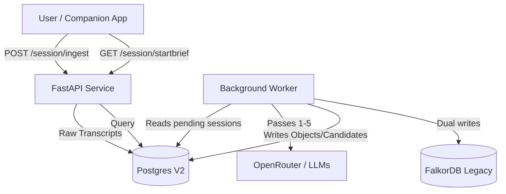

# Synapse Technical Pipeline Map

## 1. System overview

Synapse operates as a fast API layer backed by asynchronous workers that handle deep memory synthesis. It relies on a hybrid data store consisting of Postgres (with pgvector for semantic search) and an active (but slated for sunset) FalkorDB graph integration via Graphiti.



## 2. Runtime split

To ensure the API remains responsive, the architecture was recently split into two roles, managed via Docker Compose and environment variables:

*   **API Process (`synapse`):** Runs the HTTP server (FastAPI), handles ingest, auth, and fast retrieval endpoints.
*   **Worker Process (`synapse-worker`):** Reuses the same app module but runs purely as a background task processor.

**Config Flags:**
*   `SYNAPSE_RUNTIME_ROLE`: Determines the mode (`api` or `worker`).
*   `SYNAPSE_BACKGROUND_LOOPS_ENABLED`: Top-level gate (`true`/`false`) that allows the worker to start infinite `asyncio` loop tasks (e.g., `idle_close`, `outbox_drain`, `proactive_shadow_candidates`).

## 3. Input data model

Synapse ingests the following primary inputs:
*   **Sessions & Turns:** The raw chat transcript via `POST /session/ingest` and `POST /ingest`.
*   **External Events:** Integrations like `POST /integrations/google/calendar/import`.
*   **Action Updates:** Explicit user mutations on tasks via `POST /actions/items`.

Raw conversational evidence is stored immutably in `session_transcript` and parsed into factual atoms in `claims`.

## 4. Pipeline passes

The core intelligence engine runs sequentially in `src/derived_pipeline.py`.

| Pass | Name | Trigger | What it looks for | Output Tables |
| :--- | :--- | :--- | :--- | :--- |
| **Pass 1** | Triage / Classification | Session close / Ingest | Memory-worthiness, emotional weight, routing flags. | `session_classifications` |
| **Pass 1.5** | Entities | Post-triage | Discovery and resolution of people, projects, places. | `entity_candidates`, `entity_profiles`, `memory_relationship_links` |
| **Pass 2a** | Actionable Extraction | Post-triage | Tasks, reminders, habits, follow-ups. | `actionable_candidates`, `action_items` |
| **Pass 2b** | Session Changes | Post-triage | Shifts in state, focus, or major decisions. | `session_changes` |
| **Pass 2c** | Entity Candidates | Post-triage | Potential new entities that need tracking. | `entity_candidates` |
| **Pass 3** | Threads | Ongoing | Storylines, projects, and unresolved situations (open loops). | `open_threads`, `memory_relationship_links` |
| **Pass 4** | Identity | Conditions met | Synthesis of durable user traits and values. | `identity_profile`, `durable_profile_facts` |
| **Pass 5** | Living Context | Conditions met | Recent state, tension, and emotional focus. | `living_context` |

**Side Loops:**
*   `proactive_shadow_candidates`: Generates opportunities and drafts based on recent changes.
*   `daily_analysis` / `user_model_updater`: Legacy synthesis loops.
*   `v2_invariant_checker`: Self-healing data consistency checks.

## 5. Models / LLM usage

LLM calls are routed through `src/openrouter_client.py`.

*   **Primary Provider:** OpenRouter (with raw OpenAI fallback).
*   **Generic / Main LLM:** `xiaomi/mimo-v2-flash` (or `anthropic/claude-3.5-haiku`).
*   **Summary & Identity Synthesis:** `amazon/nova-micro-v1`.
*   **Heavy Extraction (Derived Pipeline):** `google/gemma-4-26b-a4b-it` (defined in `config.py`).
*   **Fallback Model:** `mistralai/ministral-3b-2512`.

**Notes:** The pipeline heavily utilizes JSON mode / structured outputs for passes 1-3. Fallback logic was recently patched to ensure valid OpenRouter slugs are used.

## 6. Storage map by role

| Role | Tables | Current Status | Target Direction |
| :--- | :--- | :--- | :--- |
| **Primary Objects** | `action_items`, `calendar_items`, `entity_profiles`, `open_threads`, `durable_profile_facts` | Missing some universal fields. | Add `primary_domain`, `salience`, `status`. |
| **Links** | `memory_relationship_links`, `memory_contradictions` | Phase 1 schema done. | Rename to `object_links`; deprecate JSON arrays. |
| **Candidates** | `actionable_candidates`, `follow_up_candidates`, `clarification_candidates` | Highly fragmented. | Merge into primary domains with `status='detected'`. |
| **Snapshots** | `living_context`, `identity_profile`, `always_on_memory_packets` | Working. | Leave alone (derived data). |
| **Evidence / Logs**| `session_transcript`, `claims`, `action_audit_log` | Working. | Keep immutable. |
| **Caches** | `identity_cache`, `episodic_memory_embeddings` | Working. | Leave alone. |
| **Legacy** | `loops`, `graphiti_outbox`, `user_model` | Active but deprecated in mental model. | Retire progressively. |

## 7. Object/domain model

The target architecture organizes data into 9 primary domains (Profile, People, Goals, Workstreams, Habits, Obligations, Events, State, Opportunities). 
*   Not every table is an object. `session_transcript` is evidence. `living_context` is a snapshot.
*   **Current implementation:** `entity_profiles` represents the People domain; `open_threads` represents Workstreams.
*   **Gap:** Objects currently lack universal metadata enforcement (e.g., `primary_domain` is missing across the DB).

## 8. Object links / graph model

Links are the connective tissue between domains.
*   **Current state:** `memory_relationship_links` connects entities to sessions (`mentioned_in`) and threads to entities (`involves`).
*   **Recent hardening:** The table now natively supports `source_domain`, `target_domain`, `status`, `strength`, `valid_from`, `valid_until`, and `expires_at`.
*   **Target direction:** Complete migration away from fragmented array linkages (like `open_threads.related_entities`) into the unified `object_links` table.

## 9. Attention and surfacing model

*   **Attention Items:** Derived runtime decisions determining *when* and *how* to surface intelligence to the user. They sit on top of baseline memory, answering "what deserves surfacing right now?".
*   **Current state (V1 Implemented):** Available via `/internal/debug/attention`. It is a read-only endpoint that queries candidate tables and objects, applying temporal expiry logic and hiding completed/suppressed items by default (supports `includeExpired=true`).
*   **Safety rules:** Applies anti-creep logic, evaluates urgency/priority, and currently maps `source_object_ids` and `source_link_ids` on a best-effort basis.
*   **Gap:** No outcome feedback loop implemented yet (e.g., recording if an item was actually surfaced and engaged with by the user). No delivery automation yet.

## 10. Companion profiles

*   **Concept:** A runtime policy defining how a specific wrapper uses Synapse. 
*   **Current state:** Defined in doctrine (`SYNAPSE_COMPANION_PROFILES.md`) but not yet implemented in code.
*   **Target direction:** The API will filter Attention Items based on the querying companion's allowed domains, state access level, and proactivity rules (e.g., Sophie gets emotional context; Ashley gets operational context).

## 11. Serving endpoints today

| Endpoint | Purpose | Status / Notes |
| :--- | :--- | :--- |
| `GET /session/startbrief` | Canonical startup packet for stateless continuity. | Active. Needs auth checks fully enforced. |
| `POST /memory/query` | Targeted recall (factual, episodic, continuity lanes). | Active. Uses a complex adapter bridging legacy/V2. |
| `GET /signals/pack` | Compact proactive steering hints. | Active. |
| `GET /user/model` | Synthesized durable user profile. | Active. |
| `POST /session/ingest` | Canonical durable write-back and queue. | Active. |
| `POST /actions/items` | Mutations on actionable objects. | Active. |

## 12. Known problems / gaps

*   **Authentication:** Critical endpoints (`/ingest`, `/session/startbrief`) still need robust internal token enforcement applied globally.
*   **Monolithic Files:** `derived_pipeline.py` (340KB) and `main.py` (700KB) are too large and brittle.
*   **Split-Brain Memory:** FalkorDB/Graphiti is still running alongside Postgres V2.
*   **Background Jobs:** Implemented as `asyncio.create_task` loops within the worker; lacks a robust queue manager like Celery.
*   **Attention Fragmentation:** No single unified queue for proactive nudges.

## 13. Recent work completed

*   Internal Auth Hardening patch applied.
*   API / Worker Runtime split implemented in `main.py` and `docker-compose.yml`.
*   OpenRouter fallback models fixed to use valid slugs.
*   Object/Domain, Object Links, Attention, and Companion Profile doctrine finalized.
*   Phase 1 of Object Links implemented (`memory_relationship_links` schema updated).

## 14. Recommended next steps

1.  **Implement Attention Read Model:** Create a unified view or endpoint for surfacing queues.
2.  **Create Magic Moment Fixtures:** Write end-to-end tests for proactive nudges.
3.  **Build Companion Profile Filtering:** Enforce profile restrictions at the API edge.
4.  **Schema Hardening:** Add `primary_domain` and `salience` to primary object tables.
5.  **Refactor Pipelines:** Break `derived_pipeline.py` into modular, domain-specific files.

## 15. Developer quickstart / commands

**Logs & Status:**
```bash
docker compose ps
docker compose logs -f synapse-worker
docker stats --no-stream
```

**Verify API Health:**
```bash
curl -fsS http://localhost:8000/health
```

**Check Background Loops (Internal):**
```bash
curl -sS http://localhost:8000/internal/debug/background_loops -H "X-Internal-Token: $SYNAPSE_INTERNAL_TOKEN"
```

**Run Smoke Tests:**
```bash
scripts/smoke_synapse_contract.sh
```

*(Note: Never run data-dropping migrations against production without a `pg_dump` backup.)*
